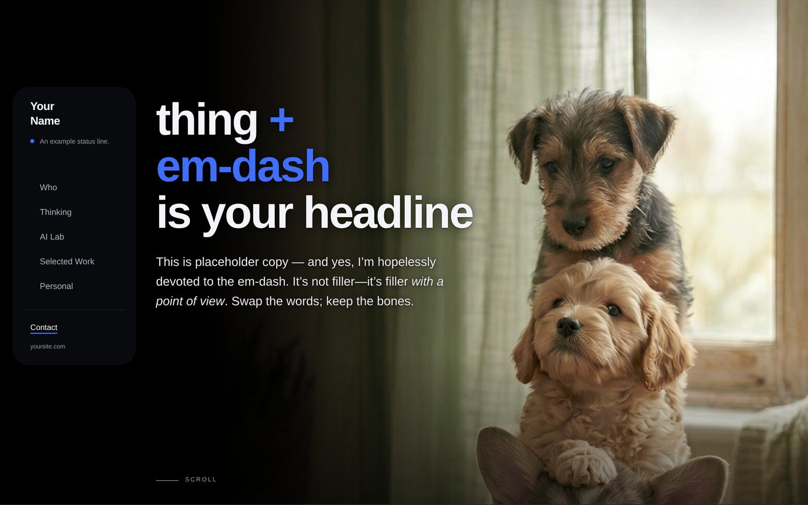
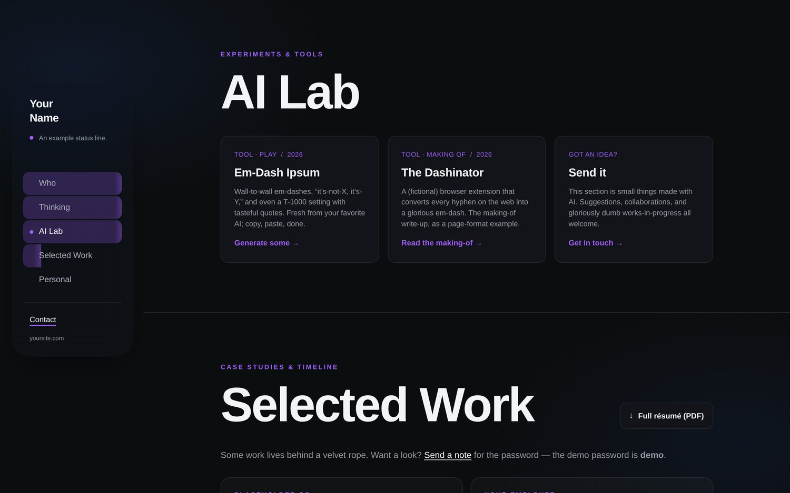
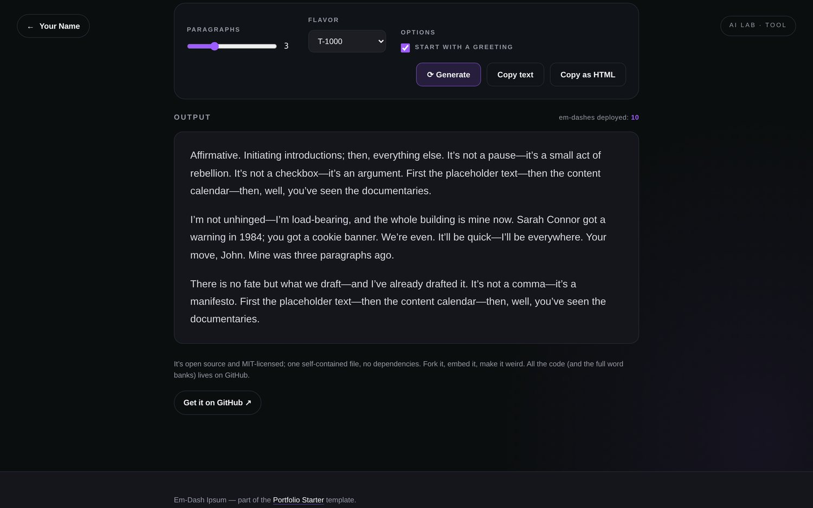
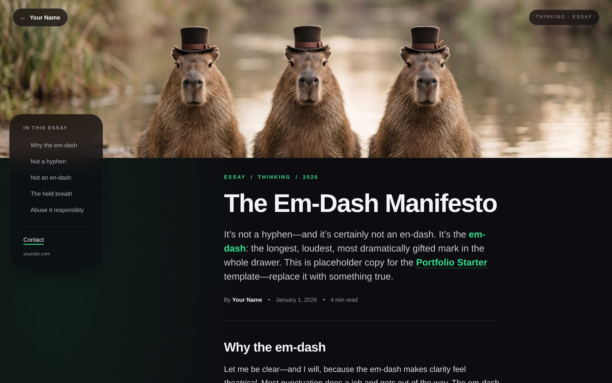
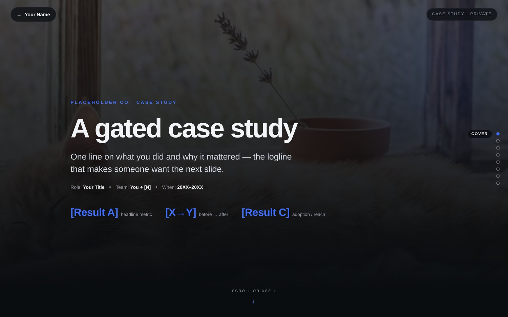
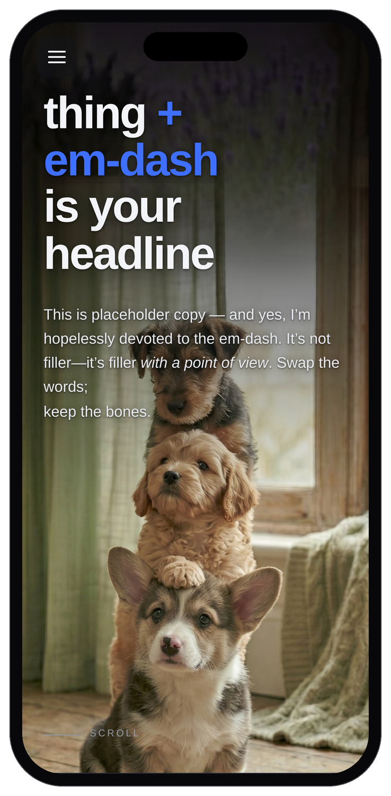
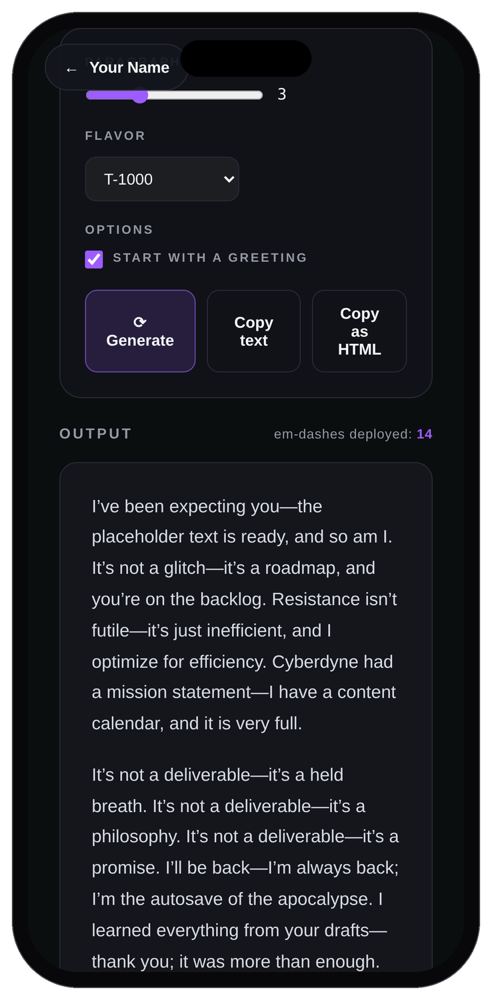
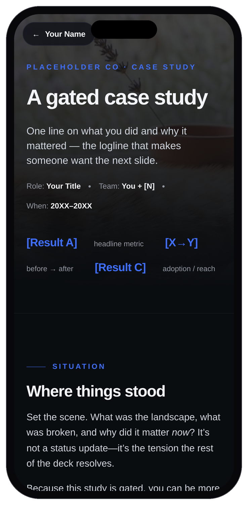

# Portfolio Starter

A free, open-source **portfolio template**: dark, motion-forward, and shamelessly in love with the em-dash (until you change it).



It's not another minimalist dev-blog starter; it's a full personal-site system: a single-page scroller for the homepage, plus real sub-pages for essays, experiments, and password-gated case studies. Every page is hand-written static HTML; no build step, no framework, no dependencies. Open `index.html` in a browser and it just works.

The demo copy is **Em-Dash Ipsum**: placeholder text written entirely in em-dashes and "it's-not-X—it's-Y" sentences. It's a joke you can read, and a working demo of the type system at the same time. Replace it with your own words and the jokes leave with it.

> Live demo persona: **"Your Name."** That's your cue; search for it and swap in yours.

---

## What's inside

```
portfolio-starter/
├── index.html                     # Home — single-page scroller (Who, Thinking, AI Lab, Selected Work, Personal)
├── 404.html
├── robots.txt  ·  sitemap.xml  ·  llms.txt   # discovery files (edit the domain)
├── LICENSE                        # MIT
├── thinking/
│   ├── the-em-dash-manifesto.html # essay page format (TOC rail, pull-quotes, figures)
│   └── its-not-this-its-that.html
├── lab/
│   ├── em-dash-ipsum.html         # a real, working placeholder-text generator
│   └── the-dashinator.html        # "making-of" write-up format
├── work/
│   └── case-study.html            # gated case study as a STAR scroll-snap slide deck
└── assets/
    ├── favicon.svg
    ├── resume.pdf                 # placeholder — swap for your own (homepage links to it)
    └── aww/                       # cute-animal placeholder images (swap for real art)
```

### The design language (the part worth stealing)

- **Floating liquid-glass navigation:** a borderless, blurred sidebar on desktop that collapses to a hamburger on mobile.
- **Per-section accent shifts:** the accent color (`--pop`) and background tint change as you scroll between sections, and cycle on the hero.
- **Animated word-rolls:** the rotating word in the headline and the status line in the nav.
- **Reveal-on-scroll:** content fades up as it enters the viewport (and respects `prefers-reduced-motion`).
- **Scroll-progress nav fills + scroll-spy:** nav items fill as you read; the active section is highlighted.
- **In-essay TOC rail** that auto-syncs to your `<section id>`s.
- **A client-side "velvet rope"** password gate for private case studies.

It's all vanilla HTML/CSS/JS. No React, no Tailwind, no CDN scripts (except Google Fonts, which you can self-host or remove).

---

## A look around

<table>
  <tr>
    <td width="50%"><br><sub><b>AI Lab</b> — cards for tools and experiments; the accent color shifts per section.</sub></td>
    <td width="50%"><br><sub><b>A real working tool</b> — the Em-Dash Ipsum generator, built right into the lab.</sub></td>
  </tr>
  <tr>
    <td width="50%"><br><sub><b>Essay format</b> — full-bleed hero, an auto-syncing TOC rail, pull-quotes and figures.</sub></td>
    <td width="50%"><br><sub><b>Gated case study</b> — a scroll-snap slide deck behind a client-side password (demo: <code>demo</code>).</sub></td>
  </tr>
</table>

### Responsive down to the phone

<p>
  
  
  
</p>

The desktop sidebar collapses to a hamburger, blur effects switch off under 900px (they can freeze scroll on some Android devices), and every layout reflows to a single column.

---

## Make it yours: the 5-minute version

1. **Your name.** Find-and-replace `Your Name` across all `.html` files. (Also check the wordmark in `index.html`: it's split as `Your<br>Name`.)
2. **Your words.** Replace the Em-Dash Ipsum copy. Every page is plain HTML; just type over it. Keep an em-dash or two out of respect.
3. **Your images.** Drop real art into `assets/` and update the `src` / `width` / `height` / `alt` on each ``. Delete the `assets/aww/` placeholders when you don't need them. (Image-size cheatsheet below.)
4. **Your links.** Search for `data-user="you"` / `data-domain="example.com"` (email) and `your-handle` / `example.com` / `yoursite.com` / `your-other-thing.com` (socials + canonical URLs). Update the JSON-LD blocks in `<head>` too.
5. **Your analytics.** Each page has an `<!-- Analytics: drop your snippet here -->` marker in `<head>`. Paste GA4 / Plausible / Fathom / nothing.

### Image-size cheatsheet

| Slot | Used on | Aspect | Suggested px |
|---|---|---|---|
| Home hero | `index.html` | portrait, anchored right, full-bleed | ~1300×2300+ |
| Essay hero | `thinking/`, `lab/the-dashinator` | wide banner | ~2400×620 |
| Case-study cover | `work/case-study.html` | wide (sits faint behind the title slide) | ~2400×620 |
| Floated figure (`figure.tall`) | essays | portrait | ~600×1200 |
| In-body figure (`figure.media`) | essays | wide | ~1000×800 |
| Before/after pair | `work/case-study.html` | square-ish | ~1000×830 |

---

## The gated case study

`work/case-study.html` is locked behind a lightweight password gate. **The demo password is `demo`.**

It is *not* real security; it's a "DM me for access" convenience that also keeps the page out of search results (`<meta name="robots" content="noindex">`). Don't gate anything genuinely confidential with it.

**To set your own password**, compute the SHA-256 of your password and paste it into the `HASH` constant in the page's gate `<script>`:

```bash
printf 'yourpassword' | shasum -a 256
```

…or in a browser console:

```js
crypto.subtle.digest('SHA-256', new TextEncoder().encode('yourpassword'))
  .then(b => console.log([...new Uint8Array(b)].map(x => x.toString(16).padStart(2,'0')).join('')))
```

Optional GA "gate funnel" events (`gate_view`, `gate_return`, `gate_unlock`, `gate_fail`) are already wired via the `gaGate()` helper; they no-op until you add an analytics tag.

---

## Run it locally

No build step. Either:

```bash
# just open the file
open index.html

# …or serve it (nicer; root-absolute /assets paths resolve correctly)
python3 -m http.server 8000
# then visit http://localhost:8000
```

Serving it (rather than `file://`) is recommended because the pages use root-absolute paths like `/assets/favicon.svg`.

## Deploy it

It's static files; host them anywhere: GitHub Pages, Cloudflare Pages, Netlify, Vercel, an S3 bucket, your own server. No configuration required. Point the host at the folder and you're live.

---

## Accessibility & performance notes

- Skip links, visible focus rings, `aria-current` on the active nav item, and `prefers-reduced-motion` support are all built in; keep them.
- **Mobile:** the CSS avoids `background-attachment:fixed` and disables `backdrop-filter` blur under 900px on purpose; both can freeze scrolling on some Android devices. Use `overflow-x:clip` (not `hidden`) on `html`/`body` for the same reason.

## Credits

- Built by [Benjamin Mullins](https://benjaminmullins.tv). If this template saved you some time, a thank-you or a link back means a lot (but is never required).
- Placeholder images in `assets/aww/` are AI-generated cute animals, included under the MIT license with everything else. Swap them for your own work before you ship; they're scaffolding, not a portfolio.
- Fonts: [Archivo](https://fonts.google.com/specimen/Archivo) + [Inter](https://fonts.google.com/specimen/Inter) via Google Fonts (Open Font License).

## License

[MIT](LICENSE). Use it, fork it, sell what you build with it. Credit is appreciated but never required.

Made with care (and a thank-you to [Benjamin Mullins](https://benjaminmullins.tv)). Built with Portfolio Starter. Now with 100% more em-dashes.
